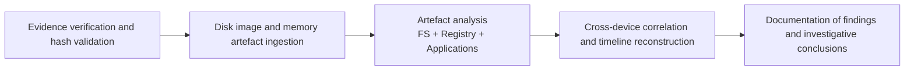

# Digital Forensic Investigation — Narcos Case Study (Windows 10 Systems)

## Project Summary
**Academic DFIR Case Study: “2019 Narcos” **

This repository documents a university-level Digital Forensics and Incident Response (DFIR) investigation conducted for ICT378. The project applies forensically sound methods to analyse multiple Windows 10 systems involved in a simulated narcotics trafficking operation.

The focus of this repository is **methodology, evidentiary reasoning, and investigative documentation**, rather than the distribution of forensic images or sensitive artefacts.

## Investigation Workflow

The investigation followed a structured DFIR workflow:

## Case Context (High-Level)
In the “2019 Narcos” academic scenario, two individuals were intercepted upon arrival with narcotics concealed in luggage. Through subsequent forensic examinations, a third party was suspected to be involved. Thus, investigation was conducted on three Windows-based systems to determine:

- Roles and involvement of each suspect
- Communication and coordination methods
- Use of concealment or anti-forensic techniques
- Presence of malware or spyware facilitating illicit activity
- Compiling evidence of drug trafficking

NOTE: Full scenario details are provided in the official assignment brief included in this repository.

---

## Investigation Objectives
- Preserve evidence integrity and chain-of-custody throughout analysis
- Identify and correlate artefacts across disk images and memory dumps
- Reconstruct user activity timelines using corroborative evidence
- Document findings clearly and defensibly for forensic reporting

---

## Tools & Technologies
- **Autopsy (v4.22.1)** – File system artefacts, browser history, registry analysis, data carving
- **Magnet AXIOM** – Memory artefacts and cross-artifact correlation
- **FTK Imager** – Image validation and hash verification
- **Command-line hashing utilities** – Integrity checks (MD5/SHA)
- **SQLite** – Case database repair and analysis support

---

## Methodology
1. **Evidence Verification**
   - Cryptographic hashing performed prior to and during analysis to ensure integrity.

2. **Forensic Acquisition & Ingestion**
   - Disk images and memory dumps analysed in isolated forensic cases.
   - Tool limitations addressed via cross-tool validation.

3. **Artefact Analysis**
   - Communications (i.e. Discord artefacts)
   - Browser activity and downloaded content
   - Suspicious documents and metadata
   - Image analysis and steganographic indicators
   - Malware and spyware traces
   - Anti-forensic behaviour (file deletion, obfuscation)

4. **Correlation & Timeline Reconstruction**
   - Metadata and system artefacts correlated across devices.
   - Timeline analysis used to support investigative conclusions.

5. **Reporting**
   - Findings documented with clear justification and evidentiary linkage.

---

## Forensic Artefact Analysis
The investigation focused on Windows 10 forensic artefacts commonly relied upon in DFIR examinations. Analysis prioritised artefacts with high evidentiary value and cross-tool verifiability.

### Operating System & User Activity
- NTFS file system metadata (MAC timestamps)
- Windows Registry hives (SAM, SYSTEM, SOFTWARE, NTUSER.DAT)
- User profile artefacts and recent activity traces
- Prefetch files and execution artefacts

### Application & Communication Artefacts
- Discord artefacts (local storage, cached data, remnants of user activity)
- Browser artefacts (history, downloads, cookies, cached content)
- Application installation and usage traces

### Memory & Volatile Data
- Process enumeration and memory-resident artefacts
- Indicators of spyware or malicious processes
- Correlation between volatile artefacts and persistent disk evidence

### Document, Image & Metadata Analysis
- Suspicious documents and embedded metadata
- Image analysis for concealment techniques
- Detection of potential steganographic indicators

### Anti-Forensics & Evasion Indicators
- File deletion and cleanup behaviour
- Evidence of obfuscation or concealment
- Tool artefacts suggesting attempts to evade detection

Artefacts were corroborated across tools and timelines to reduce false positives and strengthen evidentiary confidence.

---

## Timeline Reconstruction

Artefacts recovered from multiple systems were correlated to reconstruct user activity and communication patterns.

Sources used for timeline reconstruction included:

- NTFS timestamp metadata
- Browser activity records
- Application execution artefacts
- Communication artefacts
- Memory analysis findings

Cross-device correlation helped identify sequences of activity relevant to the narcotics trafficking operation.

## Key Findings (Summary)
- Coordinated communication and operational planning between suspects
- Evidence of concealment and obfuscation techniques
- Identification of spyware/malware relevant to surveillance and control
- Reconstructed timelines supporting investigative hypotheses

> Detailed artefacts, file contents, and extracted evidence are intentionally excluded from this repository.

---

## Limitations & Reflections

### Tool & Data Constraints
- Certain artefacts were partially corrupted or incomplete due to prior system activity and user behaviour. (Mismatching Hash Function = Corrupted File)
- Some evidence relied on indirect indicators rather than direct artefact recovery, requiring careful interpretation.
- Memory analysis is inherently time-sensitive, and not all volatile artefacts could be preserved.

### Investigative Challenges
- Tool limitations necessitated cross-validation between Autopsy (Disk Images) and Magnet AXIOM (Volatile Memory).
- Case database inconsistencies required manual repair and verification.
- Artefact interpretation required balancing automation with analyst judgement.

### Key Learning Outcomes
- Importance of validating findings across multiple forensic tools
- Understanding when artefacts are **supportive** rather than **conclusive**
- Recognising anti-forensic behaviour and its investigative implications
- Maintaining evidentiary discipline when working with sensitive material.

---

## Ethical & Legal Considerations
This repository excludes:
- Forensic images and memory dumps
- Extracted files or illicit content
- Personally identifiable information

The project is presented strictly for **educational, ethical, and demonstrative purposes**, showcasing DFIR methodology rather than evidence distribution.

